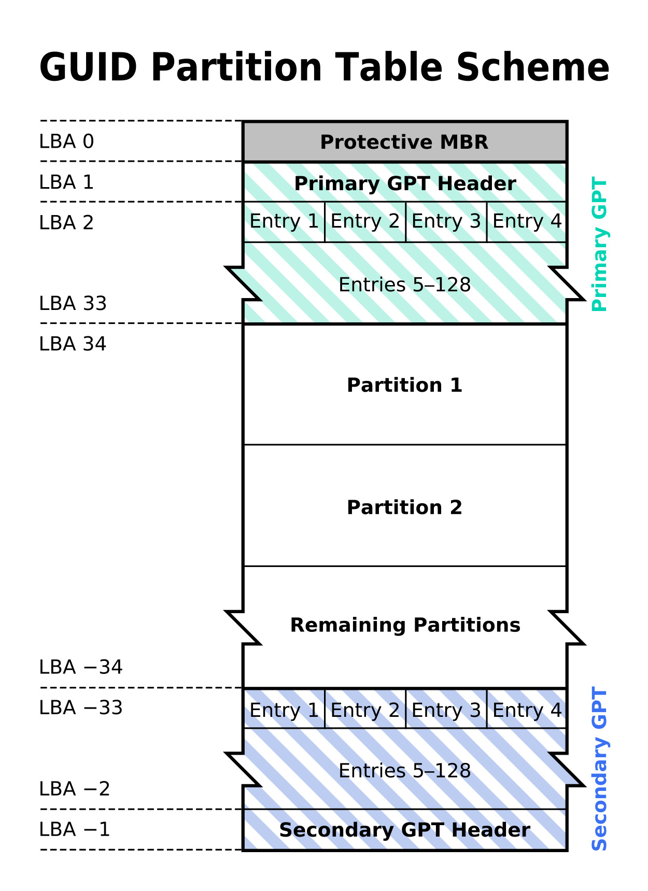

# Lab work 9: Filesystem reader

> Authors: Andrii Yaroshevych, Anastasiia Shvets
>
> Filesystems: `ext2`, `ext3`, `ext4` (with journal support)

# Description

The goal of this lab work is to implement a program that can read a disk
or partition image with a supported filesystem and display its contents,
some filesystem information, etc.

> [!IMPORTANT]
> 
> To understand the implementation details and the program in general, you are expected to have
> at least basic knowledge of the filesystem and partition table structure.
> 
> If you are not familiar with these concepts, consider reading the [References](#references) section.

# Compilation and usage

## Prerequisites

* C++ compiler: preferably `GCC` (version 12.3.0 or higher)
* `CMake` (version 3.15 or higher)
* `boost::program_options` (version 1.76.0 or higher)
* `fmt` (version 8.1.1 or higher)

> [!NOTE]
>
> For installation instructions, please refer to official documentation.

## Compilation

Use the provided `CMakeLists.txt` to compile the project:

```bash
cmake -S . -B build -DCMAKE_BUILD_TYPE=Release && cmake --build build --parallel
```

## Usage

```bash
./fs_reader <image_file> [options]
```

Where:

* `<image_file>` is the name of the image file to read
* `[options]` is a list of options to pass to the program

### Options

Here is a table of supported options:

| Option                 | Description                            | Notes                                                                            |
|------------------------|----------------------------------------|----------------------------------------------------------------------------------|
| `-h`, `--help`         | Display help message                   | Overrides all other options                                                      |
| `-i`, `--image`        | Specify image file to read             | Can be also specified as a positional argument                                   |
| `-s`, `--superblock`   | Display superblock information         |                                                                                  |
| `-r`, `--root`         | Display root directory contents        |                                                                                  |
| `-R`, `--recursive`    | Display directory contents recursively | Requires `-r` or `--root` option                                                 |
| `-j`, `--journal`      | Display journal information            | Requires filesystem with journaling enabled                                      |
| `-t`, `--transactions` | Display transactions list              | Requires filesystem with journaling enabled                                      |
| `-p`, `--partition`    | Specify partition number to read       | Only valid for disk images, i.e. images with partition table                     |
| `-P`, `--partitions`   | Display partition table                | Overrides all other options except `-h` and `--help`. Only valid for disk images |

> [!NOTE]
> 
> If no options are specified, the program will only display the superblock validity and filesystem type.

### Supported filesystems and partition tables

The program supports the following filesystems:

* `ext2`
* `ext3 (with journal support)`
* `ext4 (with journal support)`

Also, the following partition tables are supported:

* `MBR (including extended partitions)`
* `GPT`

Both filesystems and partition tables are detected automatically.

> [!TIP]
> 
> If you are trying to read a partition image, you should specify the `-p` option.
> In order to determine the partition number, please refer to the output of the `-P` option.
> 
> Also note that MBR extended partitions cannot be read directly. You should specify the logical partition
> inside the extended partition.

> [!WARNING]
> 
> Do **not** rely on output of other utilities, such as `fdisk`, `parted`, etc. to determine the partition number,
> as they may differ in interpretation of partition table data.

## Testing

In order to test the program, you will need a disk or partition image with a supported filesystem.

For your convenience, we've provided a scripts that can create such images for you automatically.
Please refer to the [scripts/README.md](scripts/README.md) for more information.

> [!NOTE]
> 
> Alternatively, you can use our ready-made images. For the sake of size, they are not included in the repository,
> but you can download them from [this repository](https://drive.google.com/drive/folders/1fgvzQ7_YzfaE-RZhHIiaR5RYWQuV9f88?usp=sharing).
> 
> This repository contains multiple images with different filesystems and partition tables for testing purposes.

# Additional tasks

* [x] Support for `ext2/ext3/ext4` filesystems
* [x] Journal support for `ext3/ext4` filesystems
* [x] Support for `MBR` partition tables (including extended partitions)
* [x] Support for `GPT` partition tables
* [x] Automatic detection of filesystem type and partition table type
* [x] Recursive directory listing

# Implementation details

The program structure can be divided into the five main parts: image dumping, reading partition table,
filesystem reading and detection, content listing and journal reading. Let's take a closer look at each of them.

## Image dumping

Before the filesystem can be read, the image file should be mapped into virtual address space of the program.
The responsibility to do so lies on the `ImageDump` class. Then, shared pointers to the `ImageDump` object 
are used throughout the project to access the image data. This approach allows us to avoid unnecessary copying of the image data.

> [!NOTE]
> 
> All methods, structures and classes related to the image dumping are located in the `inc/disk_image` and
> `src/disk_image` directories.

## Partition table reading

The `PartitionTable` class is responsible for reading the partition table from the image.

The first step is to read the Master Boot Record (MBR) from the image. The MBR is located in its first sector.

The MBR contains the partition table itself, as well as the boot code and the disk signature. If
the latter is present and valid, the type of the first partition of MBR is checked to determine the partition
table type. If the type is found to be `0xEE`, the partitioning scheme is assumed to be GPT. Otherwise,
it is assumed to be MBR. 

> [!IMPORTANT]
> 
> If the disk signature is not present or invalid, the partition table reading step is skipped and 
> the partition table is assumed to be absent.

Each partition is written into an internal vector of partitions. Each partition is represented either by
`MBR::Partition` or `GPT::Partition` class, depending on the partition table type.

> [!NOTE]
>
> All methods, structures and classes related to the partition table are located in the `inc/disk_image/structs` and 
`src/disk_image/structs` directories.

### MBR partition table


_Source: [easylinuxji.blogspot.com](https://easylinuxji.blogspot.com/2018/12/what-is-disk-partitioning-disk.html)_

The reading of the MBR partition table is straightforward. Each Partition Table Entry (PTE) contains the following fields:

* `Partition flag` - indicates whether the partition is bootable
* `CHS address of first sector` - the CHS address of the first sector of the partition
* `Partition type` - the type of the partition
* `CHS address of last sector` - the CHS address of the last sector of the partition
* `LBA of first sector` - the LBA address of the first sector of the partition
* `Number of sectors in partition` - the number of sectors in the partition

The reader iterates over all PTEs and creates a `MBR::Partition` object for each of them.

The special case is the extended partition. It is a special type of partition that can contain multiple
logical partitions. The extended partition type is `0x05` in case of CHS addressing and `0x0F` in case of LBA addressing.


_Source: [RedHat Facebook page](https://www.facebook.com/RedHatEnterpriseLinuxOfficial/posts/mbr-and-gpt-partition-scheme-differencembr-supports-22tb-of-disk-volume-and-upto/594395417372867/)_

The extended partition contains its own partition table, called Extended Boot Record (EBR) that precedes
each logical partition. The EBR contains the same fields as the MBR, except only the first two PTEs are used.
The first PTE is the logical partition itself, and the second one is the next EBR. The last EBR is filled with
zeros.


_Source: [Wikipedia](https://en.wikipedia.org/wiki/Extended_boot_record)_

The reader also iterates over all logical partitions and creates a `MBR::Partition` object for each of them.

The `LBA of first sector` field is later used to determine the offset of the partition in the image.

### GPT partition table

The GPT partitioning scheme is the modern replacement for the MBR. It is used on UEFI systems and supports
larger disks and more partitions.

In case of GPT partitioning, the first sector of the image always contains the Protective MBR (PMBR), which
is basically a dummy MBR that is kept untouched for backward compatibility. 
The UEFI specification requires that the PMBR partition table contain one partition record, 
with the other three partition records set to zero.


_Source: [Wikipedia](https://en.wikipedia.org/wiki/GUID_Partition_Table)_

The first sector, which is equal to the `LBA of first sector` field of the first PTE, contains the GPT header.
This header contains the information about the partition table, such as the number of partitions, starting
LBA of the partition table, etc.

According to the LBA of the partition table, the reader reads the partition table itself. Each partition
is represented by the `GPT::Partition` class as stated above.

## Filesystem reading and detection

> [!NOTE]
> 
> All methods, structures and classes related to the filesystem are located in the `inc/filesystem` and
> `src/filesystem` directories.

### Creating filesystem dump

When disk image is loaded into memory and the partition table is parsed, the filesystem can be read.

User can specify the partition number to read using the `-p` option. If no partition number is specified,
the program will try to read the image as a single filesystem. In this case, if the image contains a partition table,
the program will fail with an error and print the available partitions for the user to choose from.

In any case, the `FilesystemDump` object is created from the image data, either from the whole image or
from the specified partition. To avoid unnecessary copying of the image data, the `FilesystemDump` object
uses the same shared pointer to the `ImageDump` object and stores the offset and size of the filesystem
in the image.

The `FilesystemDump` object is then used to construct the `Filesystem` object, which will be later used
by the `FilesystemReader` class to read it.

### Creating filesystem object

The `Filesystem` class represents the filesystem itself. It holds two main objects: `FSInfo` and `Journal`.
The journal will be discussed later, so let's take a look at the `FSInfo` class.

The `FSInfo`, as the name suggests, contains the information about the filesystem represented by the following
fields:

* `dump` - the `FilesystemDump` object that was described above
* `super_block` - the superblock of the filesystem
* `block_size` - the size of the block in bytes
* `descriptor_table` - the descriptor table of the filesystem
* `type` - the type of the filesystem

The `FSInfo` class is separated from the `Filesystem` intentionally. This is needed for other parts of the program,
such as `Inode`, `Superblock`, `Directory`, etc. to be able to access the filesystem information without
creating unwanted circular dependencies between classes.

Here's a quick overview of these fields:

#### Superblock

The superblock is the most important part of the filesystem. It contains all important information about it,
such as the block size, the number of inodes. it's state, features, etc.

The superblock is always located at the offset 1024 bytes from the beginning of the filesystem and takes
exactly 1024 bytes. The superblock is represented by the `Superblock` class.

The block size is determined by the superblock.

#### Descriptor table

The descriptor table is a special structure that is used to define parameters of the filesystem block groups.
It provides the location of the inode bitmap and inode table, block bitmap, number of free blocks and inodes, 
and some other useful information.

The descriptor table is always located in the first block after the superblock. This is important, as
for example, on the filesystem with the block size of 1024 bytes, the group descriptor table will be located
in the third block of the filesystem, while on the filesystem with the block size of 2048 bytes or more,
it will be located in the second block.

The descriptor table is represented by the `DescriptorTable` class.

### Detecting filesystem type

This part is kind of tricky. The problem is that the filesystem type is not stored anywhere in the image.
This is likely the outcome of the strong backward compatibility of the `ext` family of filesystems, as
it is possible to mount `ext2` or `ext3` filesystem as `ext4`. `ext3` is even partially forward compatible
with `ext4`, making it possible to mount `ext4` filesystem as `ext3` after disabling some features.

This suggests us, that the filesystem type is effectively determined only by the features that are enabled
for this particular filesystem. There is simply no other way to determine the filesystem type.

The filesystem type is determined using the following algorithm:

The default filesystem type is set to `EXT2`. If it has the `EXT3_FEATURE_COMPAT_HAS_JOURNAL` feature, 
the filesystem type is set to `EXT3`, as well as if it has any other unsupported `EXT2` features. 
Finally, if the filesystem has any unsupported `EXT3` features, the filesystem type is suspected to be `EXT4`.

> [!NOTE]
> 
> As there is no way to unequivocally determine the filesystem type. The detected filesystem type can be
> interpreted **only** as a suggestion for the user. The program itself always relies on the very specific
> features it depends on only.

## Content listing

This is the main part of the program. The `FilesystemReader` provides the interface for the user to
print the desired information about the filesystem or its contents.

We will focus on parsing the directory contents, as it is the most interesting part and actually
the main task of this lab work.

### General overview

The process of parsing the directory contents starts with creating the `Directory` object from the
root directory inode. In the ext family of filesystems, the root directory inode is always `2`.
The directory entries are located in the data blocks of the directory inode.
The inode is represented by the `Inode` class. `Inode` provides its own `InodeIterator` to iterate
over the data blocks. Then, the `DirectoryIterator` is used to iterate over the directory entries
in the data blocks of the inode, incorporating the `InodeIterator`. 
The directory entries are represented by the `Dirent` class.

Now, let's take a closer look at each of these classes and related principles.

### Inode

The `Inode` class, as stated above, represents the inode of the filesystem. It mostly just wraps
the pointer to the inode in the filesystem dump and provides some useful methods to access the inode
metadata and it's contents.

In order to find the inode in the filesystem dump, the following operations are performed:

1. The inode number is converted to the inode index by subtracting 1 from it
2. The inode index is divided by the number of inodes per group to get the group index
3. To get the inode index inside the group, the inode index is divided by the number of inodes per group
   and the remainder is taken
4. The offset of the inode inside the group is divided by the block size to get the block index inside the group
5. To find the offset of the inode inside the block, the offset of the inode inside the group is divided by the block size
   and the remainder is taken
6. The number of the block, containing the inode on the filesystem, is calculated by adding the block index inside the group
   to the inode table block number in the corresponding group descriptor table entry
7. The address of the inode in the filesystem dump is then effectively determined by adding the inblock offset to the offset
    of the inode block in the filesystem dump

### Inode data

The data of inode can be stored in two ways: in the data blocks or as inline data. The latter is used
for small files, while the former is used for larger files and directories. Inline data will be discussed
later, so let's focus on the data blocks.

Depending on the filesystem features, the data blocks can be organized using different layouts.
If the inode has the `EXT4_EXTENTS_FL` feature, the data blocks are organized using the extent tree, otherwise
the data blocks are organized using the block tables. 

#### Block tables

In this case, the blocks layout is organized using the direct and indirect (up to 3 levels) block tables.


_Source: [University of Illinois at Chicago](https://www.cs.uic.edu/~jbell/CourseNotes/OperatingSystems/12_FileSystemImplementation.html)_

The first 12 entries of the inode block table are direct block pointers. The 13th entry is a single indirect block pointer,
the 14th entry is a double indirect block pointer and the 15th entry is a triple indirect block pointer. 

The conversion between the inode logical block number and the physical block number is performed by the `Inode::logical_to_block` method.

#### Extent tree

In this case, the blocks layout is organized using the extent tree. The extent tree is a special tree structure
that is used to store the data more efficiently. It was introduced in `ext4` to replace the block tables.
Extent itself is just a contiguous block of data, which is represented by the start block number and the number
of blocks in the extent.


_Source: [Data Recovery Tools](https://www.datarecoverytools.co.uk/2009/11/17/ext4-filesystem/)_

Each node of the tree begins with the extent header, which contains the number of entries and the depth of the node.
If the node is an interior node, the header is followed by the index entries, each of which points to the block
containing more nodes in the extent tree. If the node is a leaf node, the header is followed by the extent entries,
each of which points to the actual data blocks of the file. The root node of the extent tree is stored in the inode `i_block` field,
previously used for the block tables.

The conversion between the inode logical block number and the physical block number is performed by the `Inode::extent_to_block` method.

### Inline data

The inline data is stored directly in the inode itself. It was also introduced in `ext4` to store small files more efficiently.

If the file is smaller than 60 bytes, the data are stored inline in the `i_block` field of the inode. Otherwise,
the data can also be stored in the extended attribute space of the inode under the `system.data` attribute.
If the data size exceeds the size of the extended attribute space, the separate data blocks are allocated.

The `Inode` class stores the inline data in the `inline_data` field internally. This field is populated
automatically when the `Inode` object is created if the inode has the `EXT4_INLINE_DATA_FL` feature.
Due to the nature of the inline data, it is not possible to iterate over it using the `InodeIterator`, so
all methods that access the inode data should first check the return value of the `Inode::has_inline_data` method
and use the `Inode::get_inline_data` method to access it.

The reading of the inline data is performed by the `Inode::read_inline_data` method.

### InodeIterator

The `InodeIterator` simply provides the convenient interface to iterate over the data blocks of the inode.
It automatically handles the block tables and extent tree, so the difference between them is not visible
to the user.

It also automatically skips the empty blocks, if any, which is crucial for the directory parsing. This, however,
is not the case for the extent tree, as it does not contain empty blocks.

### Directory and Dirent

The `Directory` class represents the directory inode. It provides the interface to print the directory contents
and access the directory entries. The directory entries are represented by the `Dirent` class.

The `Dirent` is a simple wrapper around the `ext2_dir_entry` structure that provides a more convenient interface
for accessing the directory entry type, name, inode number, etc. It also provides the printing functionality.

### DirectoryIterator

The `DirectoryIterator` class is the most important part of the directory parsing. It provides the interface
to iterate over the directory entries in the data blocks of the directory inode.

A directory file is a linked list of directory entry structures. Each structure contains the name of the entry,
the inode associated with the data of this entry, and the distance within the directory file block to the next entry
in the list. The `DirectoryIterator` uses this distance to iterate over the directory entries within the data blocks,
incorporating the `InodeIterator` to iterate over the data blocks of the inode, if the directory entries do not fit
in a single data block, or uses the `Inode::get_inline_data` method to read the directory entries from the inline data.

> [!NOTE]
> 
> Using the standard linked list directory format can become very slow once the number of files starts growing. 
> To improve performances in such a system, modern filesystems use the indexed directory format, which allow 
> them to quickly locate the particular file searched.
> 
> However, we decided to stick with the standard linked list directory format for 2 reasons:
> 1. It provides the most general approach to parsing the directory contents thanks to the backward compatibility.
> That said, it requires a small amount of code to implement, therefore making the overall structure easier to understand.
> 2. In any case, our implementation is only intended to be used for parsing the entire directory contents recursively,
> so there will be no significant performance gain from using the indexed directory format.

## Journal reading

The journal is a special part of the filesystem that is used to store the information about the filesystem
changes before they are actually applied to the filesystem. This is needed to ensure the filesystem consistency
in case of a system crash or power failure.

The journal is represented by the `Journal` class. It provides the interface to read the journal contents
and print the journal entries (transactions).

In this lab work, we do not aim to implement the journal replaying, so the journal is read-only.

The journal is located in the data blocks of the journal inode. The journal inode is determined by the `s_journal_inum`
field of the superblock. In most cases, it is equal to `8`. 

> [!IMPORTANT]
> 
> All fields of the journal is stored in the big-endian byte order, as opposed to the little-endian byte order
> used by the rest of the filesystem. Due to this, there is a special `swap_endian` function that is used
> to swap the endianness of the journal fields. It can be found in the `inc/utils/utils.h` file.

> [!NOTE]
> 
> All methods, structures and classes related to the journal are located in the `inc/filesystem/journal` and
> `src/filesystem/journal` directories.

### Journal structure

Each journal block is preceded by the journal block header, which determines the type of the following block.
The journal block header is represented by the `JournalBlockHeader` class.

#### Journal superblock
The first block of the journal inode is the journal superblock, 
which contains the information about the journal, such as the journal UUID, journal features, etc.
The journal superblock is represented by the `JournalSuperblock` class.

The rest of the blocks are used to store the transactions.

#### Descriptor blocks

The descriptor block contains an array of journal block tags that describe the final locations
of the data blocks that follow in the journal. Descriptor blocks are open-coded instead of 
being completely described by a data structure. 

> [!NOTE]
> 
> The journal block tags structure and size depend on the journal features. There is a special function
> that is used to determine the size of the journal block tags structure with respect to the journal features:
> `journal_tag_bytes`.

The journal descriptor block is represented by the `JournalDescriptorBlock` class. It provides the interface
to iterate over the journal block tags, which are represented by the `JournalBlockTag` class.

To iterate over the journal block tags, the `DescBlockIterator` class is used. It incorporates the `journal_tag_bytes`
function to determine the offset to the next journal block tag. It also correctly handles to open-coded
`UUID` fields, the presence of which depends on `JBD2_FLAG_SAME_UUID` flag of the tag. The last tag in the descriptor
block is indicated by the `JBD2_FLAG_LAST_TAG` flag.

#### Commit blocks

The commit block is a sentry that indicates that a transaction has been 
completely written to the journal. Once this commit block reaches the journal, the data stored with 
this transaction can be written to their final locations on disk.

The commit block is represented by the `JournalCommitBlock` class. It is a simple wrapper around the `commit_header`
structure and provides the interface to access the transaction sequence number and the transaction commit time.

#### Transactions

The combination of the descriptor blocks, data blocks, and commit block is called a transaction. The `Journal`
class provides the interface to get the transactions list from the filesystem journal. It works as follows:

1. The `Journal` class reads the journal superblock and determines the journal features
2. Then, it iterates over the blocks of the journal inode, keeping track of the current transaction
3. If the current block is a descriptor block, the `Transaction` object is filled with the data from 
   the journal block tags, incorporating the `DescBlockIterator` class
4. If the current block is a commit block, the `Transaction` object is marked as complete, the timestamp
   and the sequence number are set, the transaction is added to the transactions list and the current transaction
   is reset
5. Repeat steps 3-4 until the end of the journal inode is reached

The transaction itself is represented by the `Transaction` class. It provides the interface to access necessary
transaction information and contains the following fields:

* `timestamp` - the transaction commit time
* `sequence` - the transaction sequence number
* `blocks` - the list of the blocks that were modified by this transaction

Each block is represented by the `Transaction::block` structure. It contains the following fields:

* `fs_block` - the filesystem block number
* `j_block` - the journal block number
* `flags` - the flags of the block (not used)

> [!TIP]
> 
> The transactions list can be displayed using the `-t` option. 
> 
> Also, the `-j` option can be used to display the journal superblock information.

Knowing that, let's take a look at the example output of the `-t` option:
```text
Transactions:
FS Block      J Block     Timestamp                  Sequence
        83 -> 2           Mon Dec  4 20:37:56 2023   2
        85 -> 3           Mon Dec  4 20:37:56 2023   2
        83 -> 6           Mon Dec  4 20:38:02 2023   3
        85 -> 7           Mon Dec  4 20:38:02 2023   3
        81 -> 8           Mon Dec  4 20:38:02 2023   3
```

The first column is the filesystem block number that was modified by the transaction.
The second column is the corresponding journal block number which contains the modified block.
Timestamp and sequence number are self-explanatory.

## References

This section contains a list of useful resources that were used during the development of this project.

* [ext2 documentation](https://www.nongnu.org/ext2-doc/ext2.html) (unofficial)
* [ext4 documentation](https://www.kernel.org/doc/html/latest/filesystems/ext4/) (unofficial)
* [MBR Partition table](https://wiki.osdev.org/Partition_Table)
  * [MBR Extended partitions](https://en.wikipedia.org/wiki/Extended_boot_record)
* [GPT Partition table](https://uefi.org/specs/UEFI/2.10/05_GUID_Partition_Table_Format.html)

## License

This project is licensed under the terms of the [MIT](LICENSE) license.

Copyright © 2023 Andrii Yaroshevych, Anastasiia Shvets
